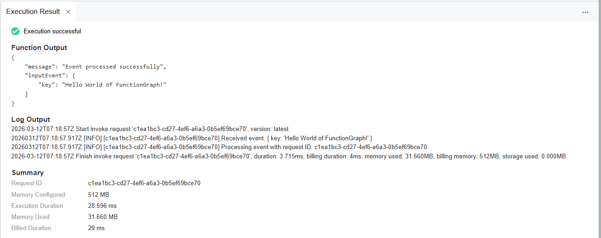

.. _creating_an_event_function_using_a_container_image_built:

Creating an Event Function using a container image built with Python
======================================================================

.. toctree::
   :maxdepth: 1
   :hidden:

For general details about how to use a container image
to create and execute an event function,
see :otc_fg_umn:`Creating an Event Function Using a Container Image and executing the Function <getting_started/creating_an_event_function_using_a_container_image_and_executing_the_function.html>`.

This chapter introduces how to create an image using Python
and perform local verification for event functions.

.. note::

  You need to implement an **HTTP server** in the image listening to port **8000** to receive requests.

  Following request path is required:

  * **POST /invoke** is the function **execution** entry where trigger events are processed.

  Following request path is optional:

  * **POST /init** is the function **initialization** entry where you can perform
    initialization operations such as loading dependencies and preparing runtime environment.
    This entry is optional, and you can choose to implement it based on your needs.
    If you do not implement this entry, FunctionGraph will directly execute the function
    without initialization.

Step 1: Create the Project
--------------------------------------------

In this example we use the `flask` framework to create an HTTP server.

For full example, see: :github_repo_master:`container-event-flask <samples-doc/container-event-flask/>` sample in the GitHub repository.

For details about Flask, see `Flask - Python web application framework <https://flask.palletsprojects.com/>`_.

Initialize the project with npm:
^^^^^^^^^^^^^^^^^^^^^^^^^^^^^^^^^^^^^^^^^^^^^^^^^^^^

First, create a project directory:

.. code-block:: bash

   mkdir -p my-event-function/src
   cd my-event-function
   python -m venv venv
   source venv/bin/activate

Then, create a requirements.txt file in the project root folder and add the following content:

.. literalinclude:: ../../../../../samples-doc/container-event-flask/requirements.txt
   :caption: requirements.txt
   
Install the dependencies using pip:

.. code-block:: bash

   python3 -m pip install -r requirements.txt

Implementing the function
^^^^^^^^^^^^^^^^^^^^^^^^^^^^^^^^^^^^^^^^^^^^^^^^^^^^

Next, create two files:

- src/main.py for the function entry and
- src/loggingmiddleware.py for the logging middleware.

File: src/index.py
""""""""""""""""""""""""""""""""""""""""
This is the main  entry file for the function:

.. literalinclude:: ../../../../../samples-doc/container-event-flask/src/main.py
   :language: python
   :caption: :github_repo_master:`src/main.py <samples-doc/container-event-flask/src/main.py>`

In this code, we create a Flask application that listens on port 8000.

We define two POST endpoints:

- **/invoke** for function execution and
- **/init** for function initialization.

File: src/loggingmiddleware.py
""""""""""""""""""""""""""""""""""""""""
The default logger implementation does not include request id and timestamp in the logs,
which makes it difficult to correlate logs with specific requests.

To add request id and timestamp to the logs, we use a middleware that runs for every request.

.. literalinclude:: ../../../../../samples-doc/container-event-flask/src/loggingmiddleware.py
   :language: python
   :caption: :github_repo_master:`src/loggingmiddleware.py <samples-doc/container-event-flask/src/loggingmiddleware.py>`

This middleware is activated in the main.py file with following lines of code:

.. code-block:: python

   from loggingmiddleware import register_logging_middleware

   ...
   register_logging_middleware(app)
   ...

Run and Test server from code
^^^^^^^^^^^^^^^^^^^^^^^^^^^^^^^^^^^^^^^^^^^^^^^^

You can run the server directly from the code to verify that it works as expected:

.. code-block:: bash

   python3 src/main.py

Then, you can send test requests to the server using curl or any API testing tool.

For example, to test the function execution entry, you can send a POST request to the **/invoke** endpoint:

.. code-block:: bash

   curl -X POST http://localhost:8000/invoke -H "Content-Type: application/json" -d '{"key": "value"}'

You should see the response from the server indicating that the event was processed successfully.

.. code-block:: json

   {"message":"Event processed successfully","inputEvent":{"key":"value"}}

Step 2: Build the Container Image
--------------------------------------------

Create a Makefile
^^^^^^^^^^^^^^^^^^^^^^^^^^^^^^^^^^^^^^^^^^^^^^^^

To simplify the development and testing process,
create a **Makefile** in the project root folder:

.. literalinclude:: ../../../../../samples-doc/container-event-flask/Makefile
   :language: make
   :caption: :github_repo_master:`Makefile <samples-doc/container-event-flask/Makefile>`
   :tab-width: 2

Create a Dockerfile
^^^^^^^^^^^^^^^^^^^^^^^^^^^^^^^^^^^^^^^^^^^^^^^^

Create a **Dockerfile** in the project root folder to define the image.

.. note::

   * | In the cloud environment, **UID 1003** and **GID 1003** are used to start the container by default.
     | The two IDs can be modified by choosing **Configuration** > **Basic Settings** > **Container Image Override**
     | on the function details page. They cannot be **root** or a **reserved** ID.

   * | If the base image of the **Alpine** version is used,
       run the **addgroup** and **adduser** instead of
       **groupadd** and **useradd** commands.

   * You can use any base image that meets your application requirements.

.. note::

  * Ubuntu images are larger in size but come with more pre-installed libraries.

  * Alpine images are smaller in size but may require additional libraries
    depending on the application requirements.

Following example uses the Python 3.10-slim image from `Docker Hub <https://hub.docker.com/_/python>`_.

.. literalinclude:: ../../../../../samples-doc/container-event-flask/Dockerfile
   :language: docker
   :caption: :github_repo_master:`Dockerfile <samples-doc/container-event-flask/Dockerfile>`

Create following entrypoint script to start the server in the container:

.. literalinclude:: ../../../../../samples-doc/container-event-flask/entrypoint.sh
   :language: shell
   :caption: :github_repo_master:`entrypoint.sh <samples-doc/container-event-flask/entrypoint.sh>`

Build and verify the image locally
^^^^^^^^^^^^^^^^^^^^^^^^^^^^^^^^^^^^^^^^^^^^^^^^

**1. Build the image**

Build the image either using **docker build** or the Makefile target **docker_build**:

.. tabs::

  .. tab:: using docker build
      Run the following command in the project root folder to build the image:

      .. code-block:: shell

         docker buildx build \
            --platform linux/amd64 \
            --file Dockerfile \
            --tag custom_container_event_flask_python:latest .

  .. tab:: using Makefile target "docker_build"
      Run the following command in the project root folder to build the image:

      .. code-block:: shell

          make docker_build

**2. Run the image locally**

Run the image either using **docker run** or the Makefile target **docker_run_local**:

.. tabs::

  .. tab:: using docker run
      Run the following command in the project root folder to run the image:

      .. code-block:: shell

         docker container run --rm \
           --platform linux/amd64 \
           --publish 8000:8000 \
           --name custom_container_event_flask_python \
           custom_container_event_flask_python:latest

  .. tab:: using Makefile target "docker_run_local"

      Run the following command in the project root folder to run the image:

      .. code-block:: shell

         make docker_run_local

**3. Test the image locally**

Test the image either using **curl** or the Makefile target **test_local**:

.. tabs::

  .. tab:: using curl
      Run the following command in a new terminal
      to test the image using a curl command:

      .. code-block:: shell

         curl -X POST -H 'Content-Type: application/json' -d '{"key":"Hello World of FunctionGraph"}' localhost:8000/invoke

  .. tab:: using Makefile target "test_local"
      Run the following command in a new terminal to test the image:

      .. code-block:: shell

         make test_local

You should see output similar to the following:

.. code-block:: json

   {"message":"Event processed successfully","inputEvent":{"key":"Hello World of FunctionGraph"}}

Step 3: Upload the Container Image to SWR (SoftWare Repository for Container)
-----------------------------------------------------------------------------

For details on SWR (SoftWare Repository for Container), see:

* :docs_otc:`Software Repository for Container User Manual <software-repository-container/umn/>`
* :docs_otc:`Uploading an Image through a Container Engine Client <software-repository-container/umn/image_management/uploading_an_image_through_a_container_engine_client.html>`
* :docs_otc:`Obtaining a Long-Term Docker Login Command <software-repository-container/umn/image_management/obtaining_a_long-term_docker_login_command.html>`

Prerequisites
^^^^^^^^^^^^^^^^^^^^^^^^^^^^^^^^^^^^^^^^^^^^^^^^

* SWR instance created.
* Credentials for SWR created.  

Upload the image to SWR
^^^^^^^^^^^^^^^^^^^^^^^^^^^^^^^^^^^^^^^^^^^^^^^^

To upload the container image to SWR, following values are needed:

.. list-table::
   :header-rows: 1
   :widths: 20 80

   * - Parameter
     - Description
   * - OTC_SDK_PROJECTNAME
     - | Your project name.
       | To obtain this, see: :api_usage:`Obtaining a Project ID<guidelines/calling_apis/obtaining_required_information.html>`
         in API usage guide but use the **project name** instead of the project ID.
   * - OTC_SDK_AK
     - Your Access Key
   * - OTC_SWR_LOGIN_KEY
     - | The login key for SWR.
       | For details see: :docs_otc:`Obtaining a Long-Term Docker Login Command <software-repository-container/umn/image_management/obtaining_a_long-term_docker_login_command.html>`
         in the Software Repository for Container user manual.
       |
       | It can be generated using the access key **${OTC_SDK_AK}** and secret key **${OTC_SDK_SK}** as follows:

        .. code-block:: shell

          export OTC_SWR_LOGIN_KEY=$(printf "${OTC_SDK_AK}" | \
                  openssl dgst -binary -sha256 -hmac "${OTC_SDK_SK}" | \
                  od -An -vtx1 | sed 's/[ \n]//g' | sed 'N;s/\n//')

   * - OTC_SWR_ENDPOINT
     - SWR endpoint, e.g. **swr.eu-de.otc.t-systems.com**
   * - OTC_SWR_ORGANIZATION
     - Your SWR organization name
   * - IMAGE_NAME
     - The name of your container image

Set the environment variables:
  .. code-block:: shell

      export OTC_SDK_PROJECTNAME=<your_project_name>
      export OTC_SDK_AK=<your_access_key>
      export OTC_SDK_SK=<your_secret_key>
      export OTC_SWR_LOGIN_KEY=$(printf "${OTC_SDK_AK}" | \
              openssl dgst -binary -sha256 -hmac "${OTC_SDK_SK}" | \
              od -An -vtx1 | sed 's/[ \n]//g' | sed 'N;s/\n//')
      export OTC_SWR_ENDPOINT=swr.eu-de.otc.t-systems.com
      export OTC_SWR_ORGANIZATION=<your_swr_organization>
      export IMAGE_NAME=custom_container_event_example

Upload the image to SWR either using **shell commands** or the Makefile target **docker_push**:

.. tabs::

   .. tab:: Pushing using shell commands
        Run the following commands in the **container-event** folder to upload the image to SWR:

        .. code-block:: shell
          :caption: **1. Login to SWR**

            docker login -u ${OTC_SDK_PROJECTNAME}@${OTC_SDK_AK} -p ${OTC_SWR_LOGIN_KEY} ${OTC_SWR_ENDPOINT}

        .. code-block:: shell
          :caption: **2. Tag the image**

            docker tag ${IMAGE_NAME}:latest ${OTC_SWR_ENDPOINT}/${OTC_SWR_ORGANIZATION}/${IMAGE_NAME}:latest

        .. code-block:: shell
          :caption: **3. Push the image to SWR**

            docker push ${OTC_SWR_ENDPOINT}/${OTC_SWR_ORGANIZATION}/${IMAGE_NAME}:latest

   .. tab:: using Makefile target "docker_push"
        Run the following command in the **container-event** folder to upload the image to SWR:

       .. code-block:: shell

          make docker_push

Step 4: Create an Event Function Using the Container Image
---------------------------------------------------------------

1. In the left navigation pane of the management console, choose **Compute** > **FunctionGraph**.
   On the :fg_console:`FunctionGraph console <>`, choose **Functions** > **Function List** from the navigation pane.
2. Click **Create Function** in the upper right corner. On the displayed page, select **Container Image**
   for creation mode.
3. Set the basic function information.

   -  **Function Type**: Select **Event Function**.

   -  **Region**: The default value is used. You can select other regions.

      **Regions are geographic areas isolated from each other.
      Resources are region-specific and cannot be used across regions through internal network connections.
      For low network latency and quick resource access, select the nearest region.**

   -  **Function Name**: Enter e.g. **custom_container_event**.

   -  **Enterprise Project**: The default value is **default**. You can select the created enterprise project.

      Enterprise projects let you manage cloud resources and users by project.

   -  **Agency**: Select an agency with the **SWR Admin** permission.
      If no agency is available, create one by referring to
      :otc_fg_umn:`Creating an Agency <configuring_functions/configuring_agency_permissions.html#creating-an-agency>`.

   -  **Container Image**: Enter the image uploaded to SWR.
      The format is: **{SWR_endpoint}/{organization_name}/{image_name}:{tag}**.

      Example: *swr.eu-de.otc.t-systems.com/my_organization/custom_container_event_example:latest*.

4. **Advanced Settings**: **Collect Logs** is disabled by default. If it is enabled,
   function execution logs will be reported to Log Tank Service (LTS).
   You will be billed for log management on a pay-per-use basis.

   ..  list-table::
      :header-rows: 1
      :widths: 20 80

      * - Parameter
        - Description

      * - Log Configuration
        - You can select **Auto** or **Custom**.

          -  **Auto**: Use the default log group and log stream.
             Log groups prefixed with "functiongraph.log.group" are filtered out.
          -  **Custom**: Select a custom log group and log stream.
             Log streams that are in the same enterprise project as your function.

      * - Log Tag
        - | You can use these tags to filter function logs in LTS.
          | You can add 10 more tags.
          | Tag key/value: Enter a maximum of 64 characters.
          | Only digits, letters, underscores (_), and hyphens (-) are allowed.

5. After the configuration is complete, click **Create Function**.

See also: :otc_fg_umn:`Step 4: Creating Function <getting_started/creating_an_event_function_using_a_container_image_and_executing_the_function.html#step-4-create-a-function>`
in the user manual.

Step 5: Test the Event Function
---------------------------------------------------------------

On the function details page, click **Test**.
In the displayed dialog box, create a test event:

- Select **blank-template**,
- set **Event Name** to **helloworld**,
-  modify the test event as follows,

   .. code-block::

      {
          "key": "Hello World of FunctionGraph"
      }

-  and click **Create**.

See also: :otc_fg_umn:`Step 5: Testing the Function <getting_started/creating_an_event_function_using_a_container_image_and_executing_the_function.html#step-5-test-the-function>`
in the user manual.

Step 6: View the Execution Result
---------------------------------

Click **Test** and view the execution result on the right.

You should see output similar to the following:

The execution result contains the following sections:

* The **Function Output** section displays the function's return value.

* The **Log Output** section displays the logs generated during function execution.

  .. note::
     This page displays a maximum of 2K logs.

* The **Summary** section displays key information from the **Log**.
